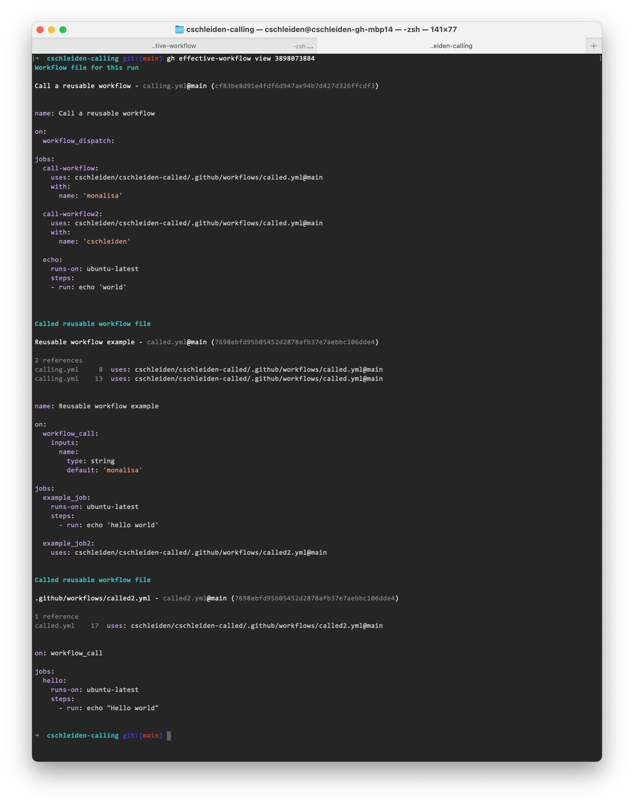

Displays the effective workflow for a workflow run. Includes all of the called reusable workflow files at the correct version.

### Install:

```bash
$ gh extension install https://github.com/cschleiden/gh-effective-workflow
```

### Usage:

```bash
$ cd demo-repo
$ gh effective-workflow view <run id>
```

#### Example

